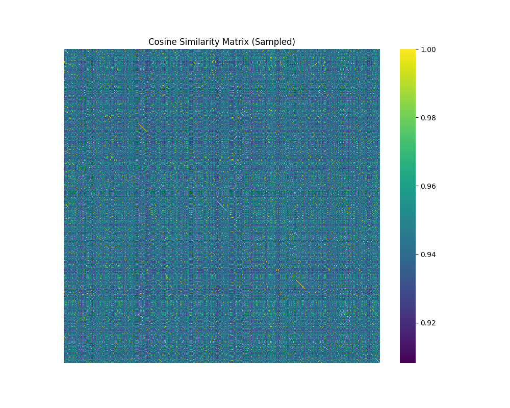
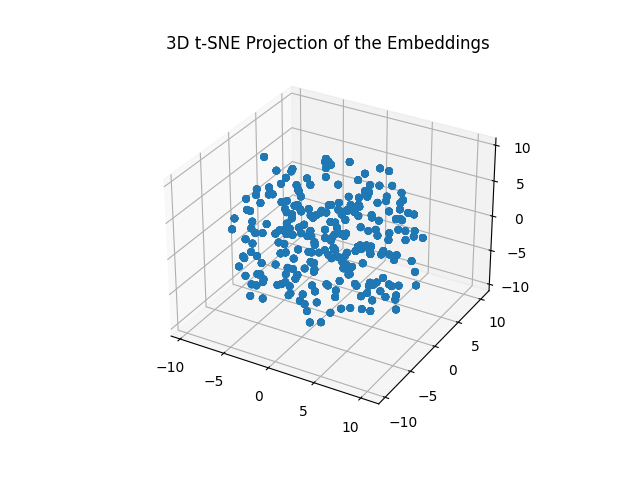
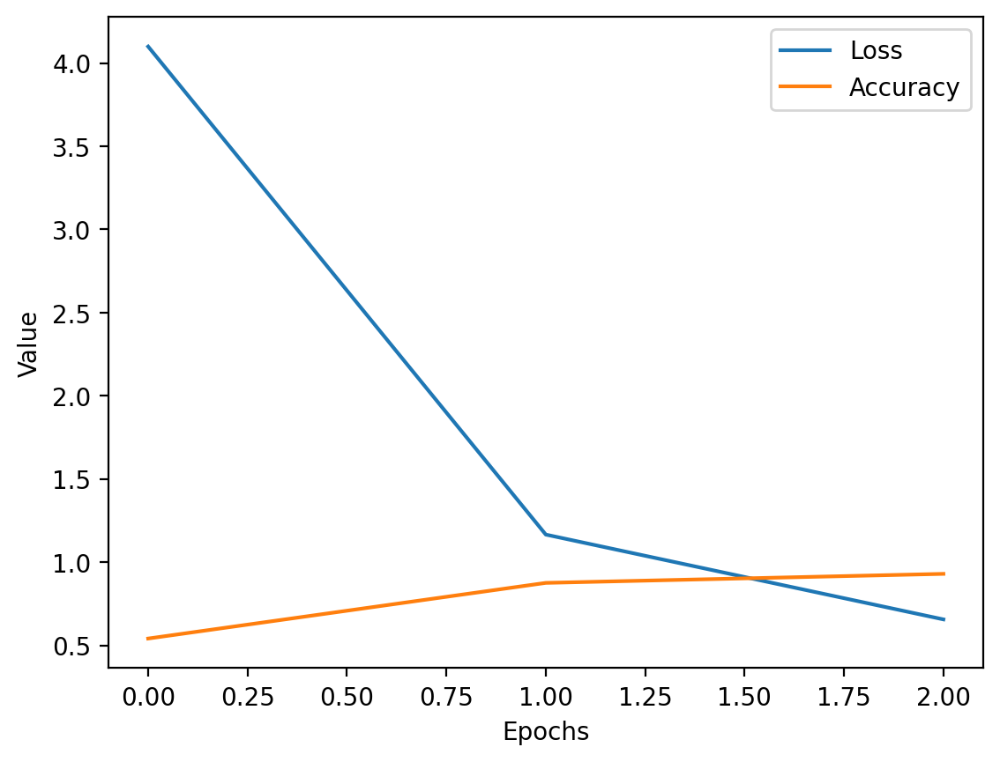

# Lumina LM - Custom GPT-based Language Model for Medical Application

## Overview

**LuminaLM** is a custom-built GPT-based language model designed for creative text generation and adaptable for medical domain-specific fine-tuning. The model leverages a transformer architecture with self-attention mechanisms and can be configured with varying levels of complexity, including the number of layers, attention heads, and embedding dimensions.

Lumina LM  generates human-like text from a given prompt and can be fine-tuned for specific domains, such as **medical text generation**. This flexibility makes the model useful for various applications, from creative writing to clinical report generation, medical diagnostics, and more.

Visit the live project at [Lumina LM ](https://www.ellanorai.org)

## Features

- **Customizable GPT-based Model**: Adjustable layers, attention heads, and embedding dimensions to meet specific requirements.
- **Creative Text Generation**: Generates human-like text based on creative prompts.
- **Medical Text Fine-tuning**: This can be fine-tuned for medical applications, such as generating clinical reports, answering medical questions, and creating research summaries.
- **User-Friendly Interface**: Provides an easy-to-use interface for inputting prompts and receiving AI-generated responses.
- **API Integration**: Developers can leverage the Lumina LM  API for text generation in their applications.
- **Custom Built Embeddings Generators**: This model leverages the Transformers architecture, to generate embeddings. 
- **Total Embeddings count**: 8474275






### Analysis of New Embeddings

The new embeddings show improved clustering and separation compared to the previous ones:

- **Cosine Similarity Matrix**: The values range between 0.92 to 1.0, showing some diversity in how the embeddings relate to each other.
- **3D t-SNE Projection**: The embeddings are more compact but less clearly separated, suggesting limited non-linear differentiation.
- **3D PCA Projection**: The embeddings form distinct clusters, showing better linear separability and a more structured representation.


## Requirements

To get started with **Lumina LM **, ensure you have the following dependencies installed:

- Python 3.7+
- PyTorch 1.7+
- Hugging Face Transformers Library
- tqdm

You can install the required packages using:

```bash
pip install -r requirements.txt
```

```bash
python tokenizer.py
```

```bash
streamlit run dashboard.py
```
