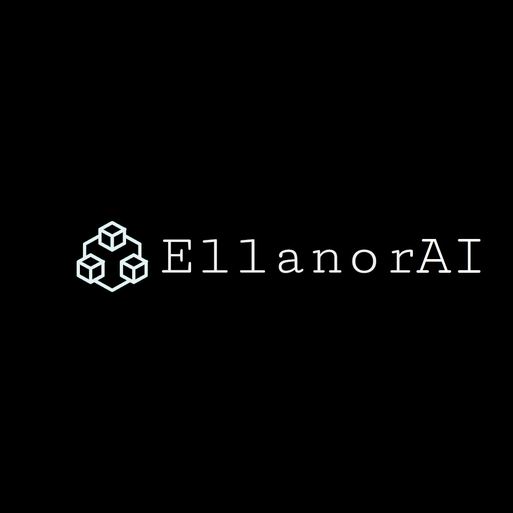

# Lumina LM - Transformer-based Language Model for Medical Application

## Overview

**LuminaLM** is a custom-built GPT-based language model designed for creative text generation and adaptable for medical domain-specific fine-tuning. The model leverages a transformer architecture with self-attention mechanisms and can be configured with varying levels of complexity, including the number of layers, attention heads, and embedding dimensions.

Lumina LM  generates human-like text from a given prompt and can be fine-tuned for specific domains, such as **medical text generation and other Scientific domains**. This flexibility makes the model useful for various applications, from creative writing to clinical report generation, medical diagnostics, and more.

Visit the live project at [EllanorAI](https://www.ellanorai.org)


## Features

- **Customizable Transformer-based Model**: Adjustable layers, attention heads, and embedding dimensions to meet specific requirements.
- **Creative Text Generation**: Generates human-like text based on creative prompts.
- **Medical Text Fine-tuning**: This can be fine-tuned for medical applications, such as generating clinical reports, answering medical questions, and creating research summaries.
- **User-Friendly Interface**: Provides an easy-to-use interface for inputting prompts and receiving AI-generated responses.
- **API Integration**: Developers can leverage the Lumina LM  API for text generation in their applications.

## Requirements

To get started with **Lumina LM**, ensure you have the following dependencies installed:

You can install the required packages using:

```bash
pip install -r requirements.txt
```

For information on the tokenizer, please refer to the [Tokenizer_documentation.md](tokens/Tokenizer_documentation.md) file. 
For more information and get access to it, contact Archit. 
