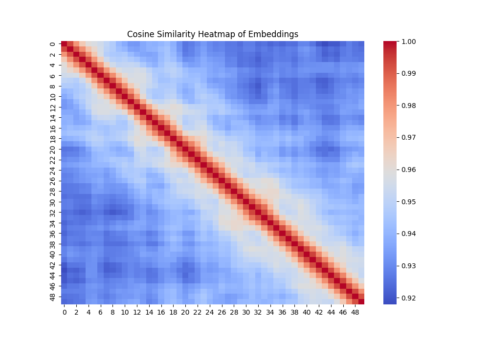
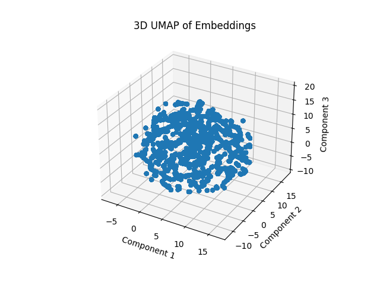

# Sentient Sculptor - Custom GPT-based Language Model for Creative and Medical Text Generation

## Overview

**Sentient Sculptor** is a custom-built GPT-based language model designed for **creative text generation** and adaptable for **medical domain-specific fine-tuning**. The model leverages a transformer architecture with self-attention mechanisms and can be configured with varying levels of complexity, including the number of layers, attention heads, and embedding dimensions.

Sentient Sculptor generates human-like text from a given prompt and can be fine-tuned for specific domains, such as **medical text generation**. This flexibility makes the model useful for various applications, ranging from creative writing to clinical report generation, medical diagnostics, and more.

Visit the live project at: [Sentient Sculptor](https://www.ellanorai.org)

## Features

- **Customizable GPT-based Model**: Adjustable layers, attention heads, and embedding dimensions to meet specific requirements.
- **Creative Text Generation**: Generates human-like text based on creative prompts.
- **Medical Text Fine-tuning**: Can be fine-tuned for medical applications, such as generating clinical reports, medical question answering, and research summaries.
- **User-Friendly Interface**: Provides an easy-to-use interface for inputting prompts and receiving AI-generated responses.
- **API Integration**: Developers can leverage the Sentient Sculptor API for text generation in their own applications.
- **Custom Built Embeddings Generators**: This model leverages the Transformers architecture, to genereate embeddings. 




## Requirements

To get started with **Sentient Sculptor**, ensure you have the following dependencies installed:

- Python 3.7+
- PyTorch 1.7+
- Hugging Face Transformers Library
- tqdm

You can install the required packages using:

```bash
pip install -r requirements.txt
```